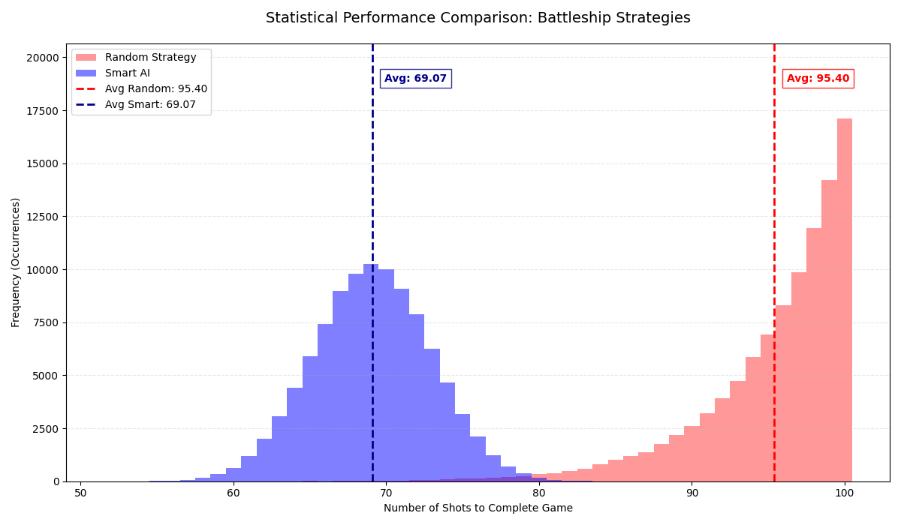

# ⚓ Battleship Monte Carlo Analysis

This project provides a high-performance simulation environment for the game **Battleship**. Using **Monte Carlo simulations**, tens of thousands of games are automated to statistically evaluate the efficiency of different gameplay strategies.

## 🎯 Project Objective
The goal is to provide a quantitative comparison between a baseline random strategy and an optimized AI. The primary metric for success is the number of shots required to sink all ships on a 10x10 grid.

### Strategies
* **Random Strategy:** Targets the board completely at random without considering previous hits or misses.
* **Smart AI:** Utilizes a **"Hunt & Target"** algorithm. In "Hunt" mode, it employs a parity (checkerboard) search pattern. Upon a hit, the AI switches to "Target" mode to systematically investigate adjacent cells.

## 🚀 Features
* **Parallel Processing:** Leverages `ProcessPoolExecutor` to distribute simulations across all available CPU cores for maximum performance.
* **Statistical Depth:** Calculates Mean, Minimum/Maximum, Standard Deviation, and Variance for comprehensive analysis.
* **Automated Plotting:** Generates professional histograms using Matplotlib, featuring highlighted mean values positioned above the data bars.
* **Reproducibility:** Implements NumPy `SeedSequence` to ensure consistent and verifiable results despite stochastic components.

## 📂 Project Structure
* `main.py`: Central entry point for simulation execution, data analysis, and chart generation.
* `src/`:
    * `game_logic.py`: Implementation of the random baseline logic.
    * `game_logic_smart.py`: Implementation of the Smart AI (Hunt & Target) logic.
    * `monte_carlo.py`: The simulation engine handling parallelization.
    * `placement.py`: Algorithm for rule-compliant random ship placement.
* `figures/`: Automatically created directory for storing result visualizations.

## 📊 Interpretation of Results
The generated histogram visualizes the distribution of game outcomes:



1.  **Average (Avg):** The further left the mean line, the more efficient the strategy.
2.  **Performance Gain:** The distance between the red (Random) and blue (Smart) lines directly visualizes the advantage of the intelligent algorithm.

## 🛠 Installation & Usage
1.  **Install dependencies:**
    ```bash
    pip install -r requirements.txt
    ```
2.  **Execute the simulation:**
    ```bash
    python main.py

    ```
